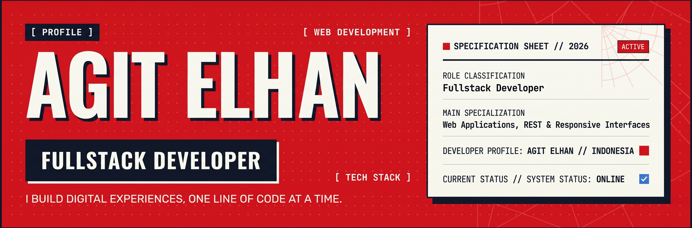

<!-- ========================================================= -->
<!-- AGIT ELHAN — GITHUB PROFILE README                        -->
<!-- ========================================================= -->

<div align="center">



</div>

<br>

---

<div align="center">

### `[ PROFILE // FULLSTACK DEVELOPER ]`

**I build digital experiences, one line of code at a time.**

🇮🇩 Indonesia &nbsp;•&nbsp; 💻 Fullstack Developer &nbsp;•&nbsp; 🎓 Informatics Engineering

</div>

---

## `[ ABOUT ME ]`

<table>
<tr>
<td width="60%">

### AGIT ELHAN

I'm **Agit Elhan**, a Fullstack Developer and Informatics Engineering student from Indonesia.

I enjoy transforming ideas into functional digital products — from designing interfaces to building backend systems and REST APIs.

My development focus includes:

- 🌐 Modern Web Applications
- ⚡ Fullstack Development
- 🔌 REST API Development
- 🗄️ Database Design
- 🎨 UI/UX Implementation
- 🏗️ Clean & Maintainable Code

</td>

<td width="40%">

```text
┌──────────────────────────────┐
│  DEVELOPER PROFILE           │
├──────────────────────────────┤
│                              │
│  NAME                        │
│  AGIT ELHAN                  │
│                              │
│  ROLE                        │
│  FULLSTACK DEVELOPER         │
│                              │
│  LOCATION                    │
│  INDONESIA                   │
│                              │
│  STATUS                      │
│  ● ONLINE                    │
│                              │
└──────────────────────────────┘
```

</td>
</tr>
</table>

---

## `[ TECH STACK ]`

### `01 // FRONTEND`

<div align="left">


</div>

### `02 // BACKEND`

<div align="left">


</div>

### `03 // DATABASE & TOOLS`

<div align="left">


</div>

---

## `[ EXPERIENCE ]`

### `01 // FARKATECH`

**INTERNSHIP — 2026 → PRESENT**

Working in an IT environment focused on digital solutions and software development.

Areas of involvement:

```text
WEB DEVELOPMENT
       ↓
APPLICATION DEVELOPMENT
       ↓
DATABASE
       ↓
UI / UX
       ↓
DIGITAL SOLUTIONS
```

---

## `[ FEATURED PROJECTS ]`

### `01 // NIAGA JAYA ELECTRONIC`

> **E-Commerce Platform**

A web-based e-commerce system developed for an electronics business.

**Technology:**

`Next.js` `Laravel` `Livewire` `PostgreSQL` `Supabase` `Clerk` `Midtrans`

**Main Features:**

- 🛒 Product catalog
- 🔎 Product search
- 🛍️ Shopping cart
- 💳 Payment integration
- 📦 Order management
- ⭐ Product reviews
- 🧾 Invoice generation
- 👤 Authentication

---

### `02 // SPIDER-MAN PORTFOLIO`

> **Personal Developer Portfolio**

A personal portfolio designed with a custom red, blue, white and navy visual identity inspired by comic-book and spider-web aesthetics.

**Technology:**

`Next.js` `React` `TypeScript` `Tailwind CSS` `Laravel API`

**Main Features:**

- 🕷️ Custom visual identity
- 🎨 Editorial UI
- ⚡ Scroll animations
- 📱 Responsive design
- 🔌 REST API integration
- 🧩 Dynamic project system

---

### `03 // SIMRS BUNDA SEJATI`

> **Hospital Information System**

A web-based information system designed to manage different hospital operational workflows.

**Technology:**

`Laravel` `Livewire` `MySQL`

**Main Modules:**

```text
SUPER USER
ADMIN
RECEPTIONIST / CASHIER
DOCTOR
PHARMACY
PATIENT MANAGEMENT
PHARMACY QUEUE
```

---

## `[ CURRENTLY BUILDING ]`

<table>
<tr>

<td width="50%">

### 🕷️ SPIDER-MAN PORTFOLIO

Improving the visual system, animations, project showcase and API architecture of my personal portfolio.

</td>

<td width="50%">

### ⚡ FULLSTACK APPLICATIONS

Continuously building practical applications using Laravel, Next.js, React and REST APIs.

</td>

</tr>
</table>

---

## `[ DEVELOPMENT FOCUS ]`

```text
┌────────────────────────────────────────────────────┐
│                                                    │
│  WEB APPLICATIONS                                  │
│                                                    │
│  REST API                                          │
│                                                    │
│  CLEAN ARCHITECTURE                                │
│                                                    │
│  DATABASE DESIGN                                   │
│                                                    │
│  UI / UX                                           │
│                                                    │
│  PERFORMANCE                                       │
│                                                    │
└────────────────────────────────────────────────────┘
```

---

## `[ GITHUB ACTIVITY ]`

<div align="center">


</div>

---

## `[ DEVELOPER PHILOSOPHY ]`

<div align="center">

> **"With great power comes great responsibility."**

</div>

For me, software development isn't simply about making an application work.

It's about creating something that is:

```text
USEFUL
  +
RELIABLE
  +
MAINTAINABLE
  +
MEANINGFUL
```

Every project is another opportunity to learn, improve and build something better.

---

## `[ CURRENT STATUS ]`

```text
┌─────────────────────────────────────────────┐
│                                             │
│  SYSTEM STATUS      : ONLINE                │
│  DEVELOPER          : AGIT ELHAN            │
│  ROLE               : FULLSTACK DEVELOPER   │
│  LOCATION           : INDONESIA             │
│  FOCUS              : WEB DEVELOPMENT       │
│  API                : REST                  │
│  STATUS             : BUILDING              │
│                                             │
└─────────────────────────────────────────────┘
```

---

## `[ CONNECT ]`

<div align="center">

[](https://github.com/AgiteElhan)

[](https://agitelhan-portfolio.vercel.app)

</div>

---

<div align="center">

```text
[ BUILD ]  [ LEARN ]  [ CREATE ]  [ IMPROVE ]
```

### 🕷️ AGIT ELHAN

**FULLSTACK DEVELOPER**

`// ONE LINE OF CODE AT A TIME.`

</div>
